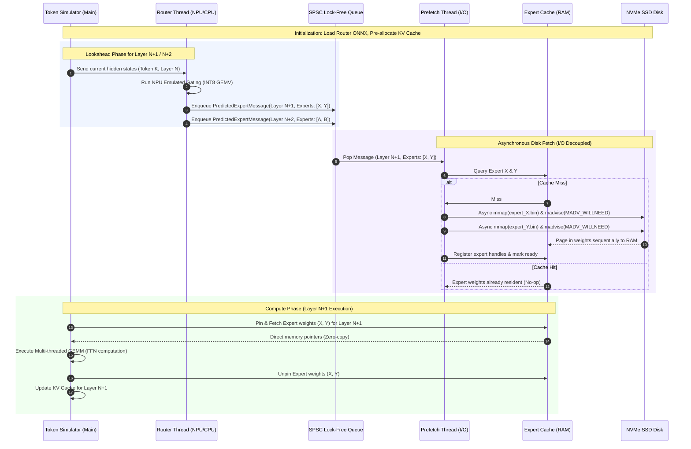

# Dataflow Specification - Heterogeneous MoE Local Inference Engine

This document details the data lifecycle, token execution paths, and lookahead prefetch scheduling timelines of the Heterogeneous MoE Local Inference Engine.

---

## 1. Token Inference Data Path

Every token processed by the MoE engine flows through a multi-stage pipeline across the NPU, CPU, SSD, and RAM. Below is the trace of a single token's progression.



---

## 2. Decoupled Pipeline Timeline (Compute-I/O Overlap)

To prevent the Compute Thread from stalling due to SSD I/O, the Router Thread computes gating matrices several layers in advance. Below is the scheduling matrix illustrating how Lookahead, Prefetch, and Compute run in parallel.

| Timeline Step | Compute Thread (CPU) | Router Thread (NPU) | Prefetch Thread (I/O) |
| :--- | :--- | :--- | :--- |
| **Step 1** | Execute Layer $N$ | Predict Layer $N+1$ Experts | Idle / Sleep |
| **Step 2** | Execute Layer $N$ | Predict Layer $N+2$ Experts | Prefetch Layer $N+1$ Experts from SSD |
| **Step 3** | Execute Layer $N+1$ (Cache Hit) | Predict Layer $N+3$ Experts | Prefetch Layer $N+2$ Experts from SSD |
| **Step 4** | Execute Layer $N+2$ (Cache Hit) | Predict Layer $N+4$ Experts | Prefetch Layer $N+3$ Experts from SSD |

---

## 3. PredictedExpertMessage Schema

Communication between the Router and Prefetch threads occurs via a lightweight message payload written to a lock-free queue:

```cpp
struct PredictedExpertMessage {
    uint32_t token_index;       // Sequence position of token
    uint32_t layer_id;          // Destination MoE Layer index
    uint32_t top_k_experts[2];   // Array of target expert IDs (Top-2 routing)
    float confidence_scores[2]; // Gating probabilities for scaling activations
    uint64_t timestamp_ns;      // High-precision queue entry timestamp
};
```

This structural layout ensures that the Prefetch Thread has all metadata required (which file to open, where to locate it on disk) to begin memory-mapping the expert weights before the Compute Thread enters the target layer.
